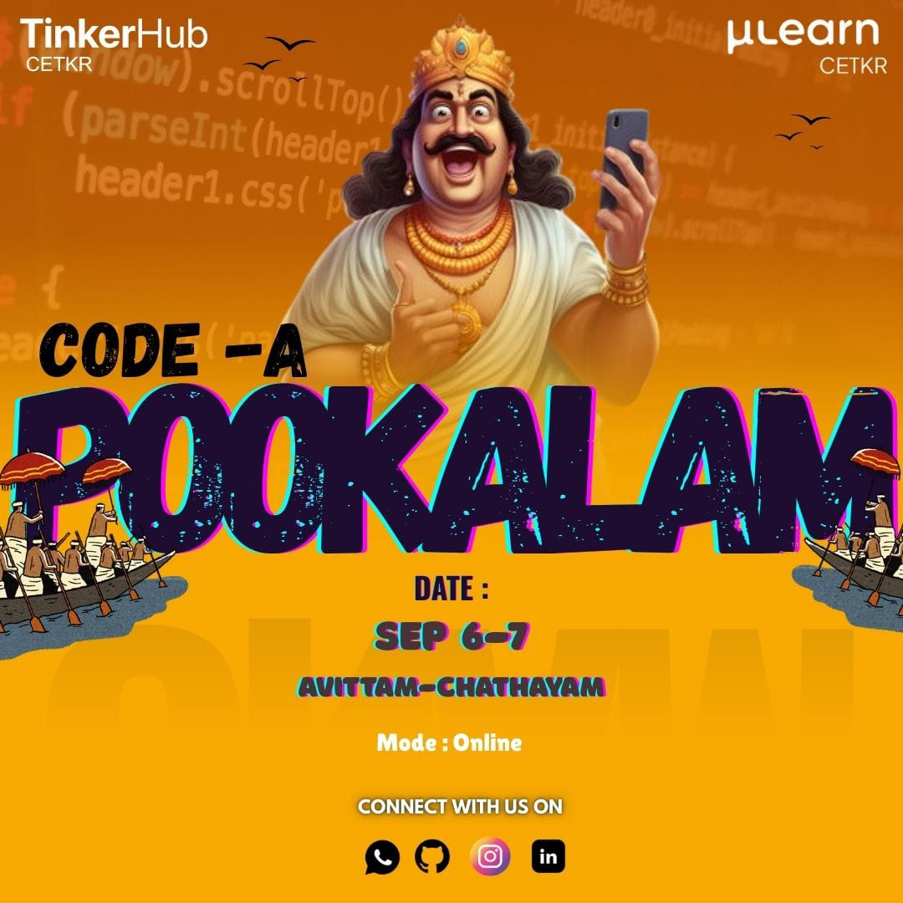

# code-a-pookkalam
"🌸 Get Ready for Code - A - Pookalam Celebration 2025! 🌼✨

Join us for a vibrant celebration of culture, unity, and joy as we create stunning floral carpets! 🌺

Register now :
https://forms.gle/8YMkjWfnnXiPqctt5

## Important Details:

- Submission Deadline: September 7th, 2025 (midnight) 📝
- Presentation: Showcase your masterpiece in a 2-minute presentation on September 8th (7:30-8:15 PM) 🎤
- Participation: Solo participants only 👤

## What to Expect:

- A traditional Pookalam competition with a twist! 🌺
- Onam special vibes and fun rewards for creativity & effort 🎉
- Exciting prizes:
    - First Prize: Chaya & Puffs ☕🥟
    - Second Prize: Kattan & Samosa ☕🥟
    - Prolsahanm: Kacha Mango

## Guidelines:

1. Individual participation only 🤝
2. Judging criteria: Creativity, coding quality, design, and theme relevance 🤔
3. Use any coding language or platform you love! 💻
4. Original work only - no plagiarism allowed! 📚
5. Theme: Spirit of Onam
## Quick Submission Guide
1. Fork this Repository

   Click the Fork button at the top-right of this page.

2. Clone Your Fork
   
   On your computer, run git clone https://github.com/ blablabla.

3. Add Your Project

   Inside the cloned folder, create a new folder with your name (e.g., Your-Name) and add all your project files to it.
   
4. Upload Your Changes

   Run the following commands in your terminal:

```Bash

git add .
git commit -m "Add submission: Your Name"
git push
```

5. Create a Pull Request

     Go to your forked repository on GitHub and click the "Compare & pull request" button to submit your work.

And thats all! all the best :)

Having troubles?? just ask an AI or contact any of us.
<div align="center">
  
</div>
